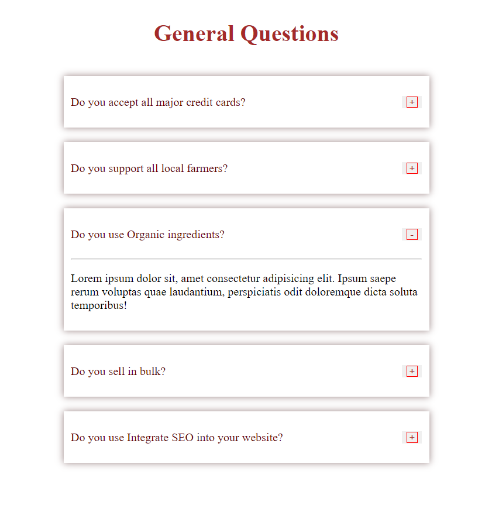

# JAVASCRIPT WEBCOMPONENTS PRACTISE
All the components showcased are responsive

## 1. Menu
Listings of different items present in the menu of a restaurant.
You can see all and also filter different categories

### Desktop view

### Mobile view

## 2. Faqs
This mimicks the Frequentsly asked questions commonly seen on websites. As one opens, the formerly opened faq closes

## 3. Scroll Website
A one-page website to showcase fixing headers as a page is scrolled making it responsive

### Desktop View

### Mobile View

## 4. Review Card
The data for each review is gotten from an API I built with pure PHP.
It sends a simple XMLHttpRequest to get the data then rendered appropriately

## 5. Video Project
Using javascript to control the playing video.
Also, a preloader that displays while the website is still loading element to be rendered
### Preloader

### sample image
